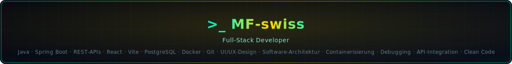
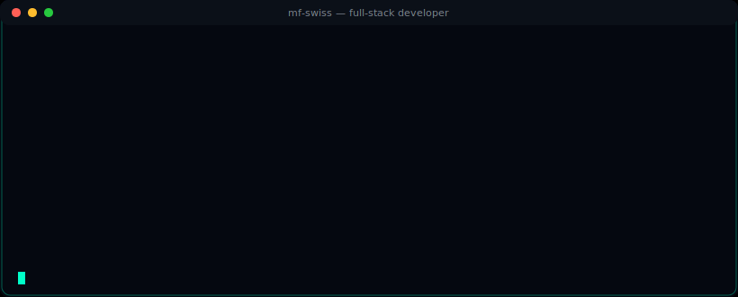

 

---

## Über dieses Profil

Ich baue Full‑Stack‑Anwendungen, die sowohl technisch solide als auch visuell ansprechend sind.
Backend‑Logik mit Spring Boot, moderne Frontends mit React, ergänzt durch DevOps‑Elemente wie Docker und automatisierte Build‑Prozesse.

Mein Fokus: klare Architektur, hochwertige Interfaces und nachhaltige Software‑Entwicklung.

---

## Tech Stack

  
  
  
  
  
  
  
  
  

---

## Kontakt

[Portfolio](https://mf-swiss.github.io/) · [LinkedIn](https://www.linkedin.com/in/mfritsche/) · [GitHub](https://github.com/mf-swiss)