<div align="center">


<br/>



</div>

---

### 🟩 System Boot
```bash
$ sudo boot --mf-swiss --dark-ops

> Initializing Gold-Neon Kernel...
> Loading modules...
> Establishing secure shell...
> UI/UX engine: calibrated
> Status: ONLINE
```
→ mehr dazu in [`sections/intro.md`](sections/intro.md)

---

### 🟩 System Status
```bash
$ systemctl status developer.service

● mf-swiss.service
   Loaded: active
   Core: React | Vite | CSS | UI/UX
   Toolchain: VS Code | GitHub
   Uptime: ∞
```
→ Details in [`sections/status.md`](sections/status.md)

---

### 🟩 Tech Stack

<p align="center">
  
  
  
  
</p>

→ vollständiges Badge-Set in [`sections/badges.md`](sections/badges.md)

---

### 🟩 GitHub Stats


---

### 🟩 Skills-Matrix
→ [`sections/matrix.md`](sections/matrix.md)

### 🟩 ASCII-Art (Doku)
→ [`sections/animation.md`](sections/animation.md)

### 🟩 Kontakt
→ [`sections/contact.md`](sections/contact.md)

</div>